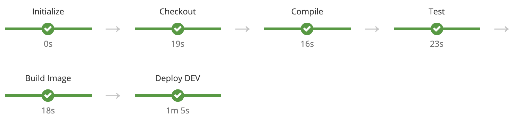

# OpenShift CI/CD Pipelines

Basic demonstration of OpenShift CI/CD pipelines for deploying applications across environments using advanced deployment strategies like Blue/Green.

## Documentantion

* [Introduction](./docs/introduction)
* [Usage](./docs/usage)
* [Extras](./docs/extras)
    * [Approvals](./docs/extras/approvals)
    * [Cross-Cluster Image Promotions](./docs/extras/cross-cluster)

## Note

This repository serves as an incubator for new features, to apply this pipelines in real scenarios the application and the pipeline library must be splitted.

## Pipelines

The pipelines use the declarative approach and the [OpenShift Jenkins Pipeline Plugin](https://github.com/openshift/jenkins-client-plugin).

### CI

### CD

## Pipeline Library

The pipelines use a shared library for common functionality, the library is embedded in this repository but can be externalized in other Git repository as well.

## Demo

### Create the Projects

These projects (environments) are used to deploy the application:

    oc new-project dev
    oc new-project test
    oc new-project prod

This project is used to deploy the Jenkins instance:

    oc new-project jenkins

### Create the Secrets (Optional)
    
If the repository used is private a pull Secret is needed in **dev** (to pull the pipelines and the application source code) and **jenkins** (to pull the pipeline library).

The Secrets need to be label with **credential.sync.jenkins.openshift.io=true** to be synchronized in Jenkins as Credentials thanks to the [OpenShift Jenkins Sync Plugin](https://github.com/openshift/jenkins-sync-plugin). 

In **dev** an annotation is used to automatically assign the Secret to any BuildConfig that matches the Git URI used.

The commands to create and label the Secrets are:

    oc create secret generic repository-credentials --from-file=ssh-privatekey=$HOME/.ssh/id_rsa --type=kubernetes.io/ssh-auth -n dev
    oc label secret repository-credentials credential.sync.jenkins.openshift.io=true -n dev
    oc annotate secret repository-credentials 'build.openshift.io/source-secret-match-uri-1=ssh://github.com/*' -n dev

    oc create secret generic repository-credentials --from-file=ssh-privatekey=$HOME/.ssh/id_rsa --type=kubernetes.io/ssh-auth -n jenkins
    oc label secret repository-credentials credential.sync.jenkins.openshift.io=true -n jenkins

### Create a Preconfigured Jenkins Instance with S2I

A custom preconfigured Jenkins instance is created with the following commands:

    oc new-build jenkins:2 --binary --name custom-jenkins -n jenkins
    oc start-build custom-jenkins --from-dir=./jenkins --wait -n jenkins
    oc new-app --template=jenkins-ephemeral --name=jenkins -p JENKINS_IMAGE_STREAM_TAG=custom-jenkins:latest -p NAMESPACE=jenkins -n jenkins

Finally a set of permissions need to be granted:

    oc adm policy add-role-to-user edit system:serviceaccount:jenkins:jenkins -n dev
    oc adm policy add-role-to-user edit system:serviceaccount:jenkins:jenkins -n test
    oc adm policy add-role-to-user edit system:serviceaccount:jenkins:jenkins -n prod

### Create the Pipelines

#### Creating the BuildConfigs Directly

A pipeline is a BuildConfig of type **JenkinsPipeline** so for creation the **new-build** command is used:

#### CI 

    oc new-build ssh://git@github.com/redhatcsargentina/openshift-cicd-pipelines.git --name=hello-service-ci-pipeline --context-dir=./pipelines/ci --strategy=pipeline -e APP_NAME=hello-service-ci -n dev
    
#### CD

    oc new-build ssh://git@github.com/redhatcsargentina/openshift-cicd-pipelines.git --name=hello-service-pipeline --context-dir=./pipelines/cd --strategy=pipeline -e APP_NAME=hello-service -n dev

After the execution of this commands the pipelines are automatically started.

#### Using Templates

Another creation method is using Templates:

#### CI 

    oc create -f ./pipelines/ci/ci-pipeline.yaml -n dev
    oc new-app --template ci-pipeline -p APP_NAME=hello-service-ci -p GIT_REPO=ssh://git@github.com/redhatcsargentina/openshift-cicd-pipelines.git -p GIT_BRANCH=master -n dev

#### CD

    oc create -f ./pipelines/cd/cd-pipeline.yaml -n dev
    oc new-app --template cd-pipeline -p APP_NAME=hello-service -p GIT_REPO=ssh://git@github.com/redhatcsargentina/openshift-cicd-pipelines.git -n dev
