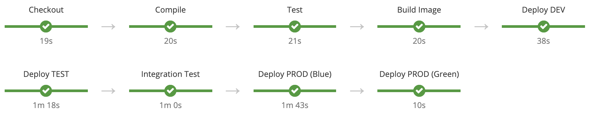

# OpenShift CI/CD Pipelines

Basic demonstration of OpenShift CI/CD pipelines for deploying applications across environments using advanced deployment strategies like Blue/Green.

## Pipelines

### CI

### CD

## Documentation

* [Introduction](./docs/introduction)
* [Usage](./docs/usage)
* [Extras](./docs/extras)
    * [Image Promotion Approvals](./docs/extras/image-promotion-approvals)
    * [Cross-Cluster Image Promotions](./docs/extras/cross-cluster)
    * [Maven Agent with Persistent Storage](./docs/extras/maven-agent-persistent-storage)
    * [OpenShift Role to Jenkins Permission Mapping](./docs/extras/openshift-jenkins-role-mapping)
    * [Jenkins Behind a Corporate Proxy](./docs/extras/jenkins-behind-proxy)
    * [Custom Roles](./docs/extras/custom-roles)
* [Demo](./docs/demo)
* [Workshop](./docs/workshop)

    

