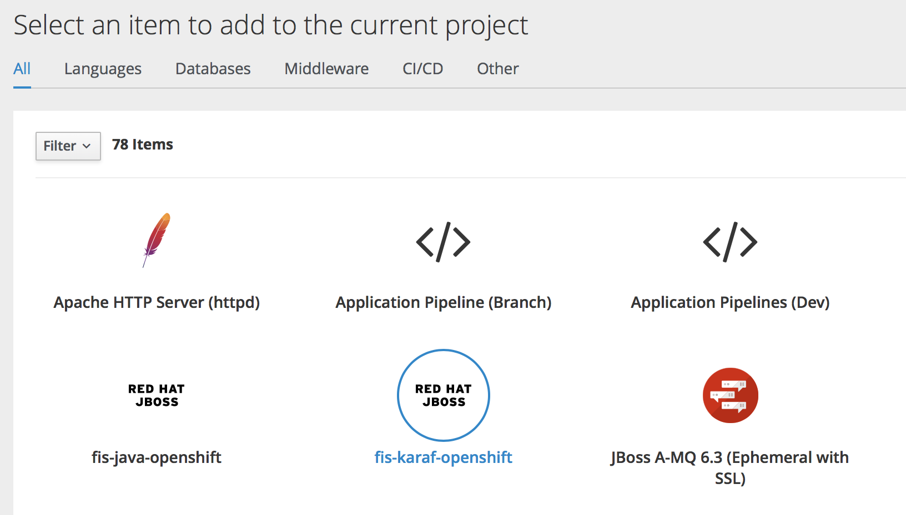
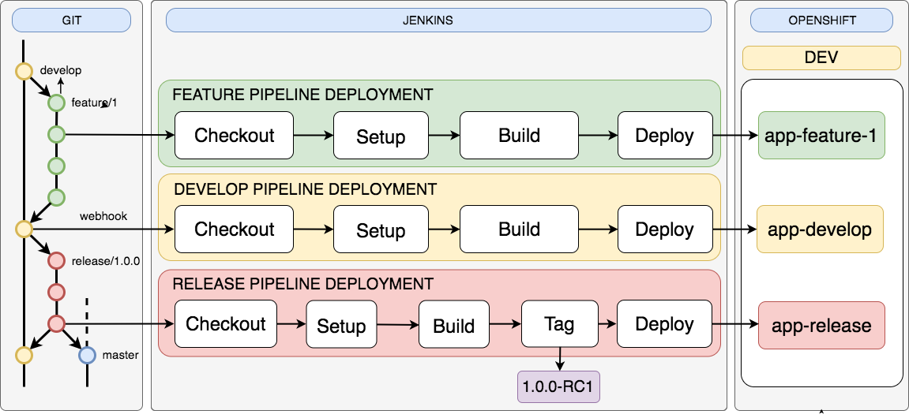
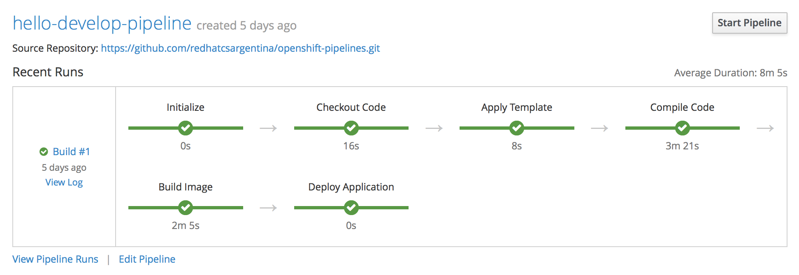
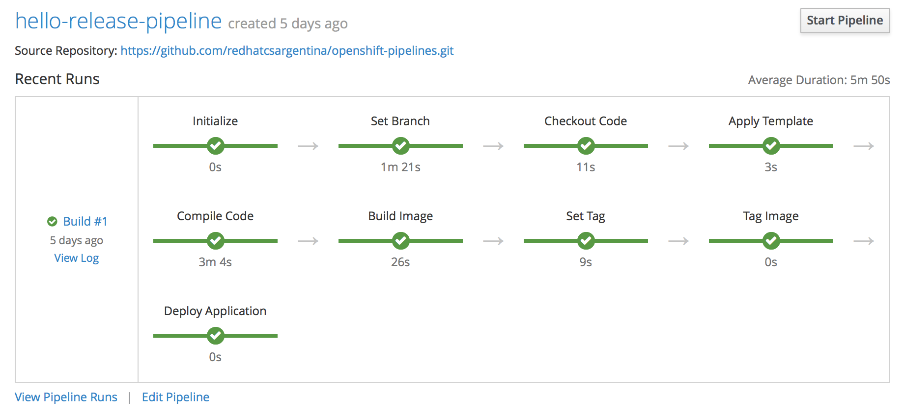
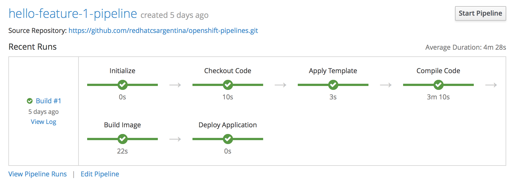
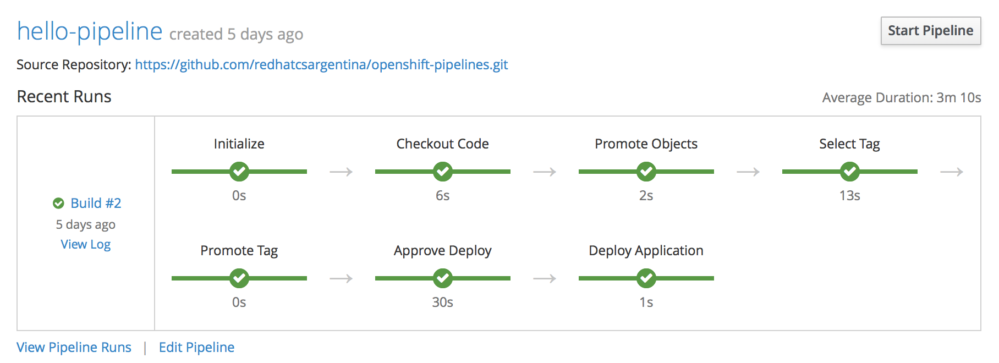
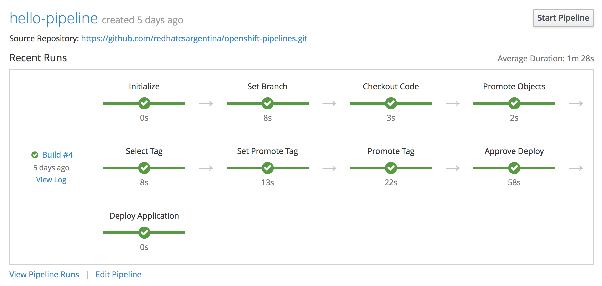

# openshift-pipelines

## Introduction

This demonstration shows a set of basic CI/CD pipelines. It is intended to be used by different groups of developers and operators (DevOps). 

A set of templates exists to expose the self-service capability of OpenShift, meaning that a developer can create its own pipelines without having to create a ticket that a given operator would be attending.

There is a template for each environment. 

For example, the template for development creates a pipeline for basic continous integration (CI) and a pipeline which generates a release candidate (RC) to be deployed in testing.

In development stage, we encourage the use of Gitflow metodology, that being said, the CI pipeline will checkout the code from develop branch, the release pipeline will checkout an specific release branch and there is an extra template, which creates a feature pipeline, allowing developers to deploy an specific branch into the OpenShift development project.

This is an easy way to show the OpenShift (containers) capabilities, in the old VM model, having an application deployed twice (or more) at the same time, required more virtual machines. Nowadays with containers it is easy to accomplish this with less effort and hardware.

## Demo

The repository contains the **setup.sh** script used to generate the two clusters (a non-prod and a prod cluster), both cluster are MiniShift clusters.

### Requirements

* MiniShift
* oc CLI command

## Environments

### DEV

#### Templates

The development templates are:

* Application Pipelines (Dev) - dev-pipelines-template 

Creates the develop and release pipelines for a given application.

* Application Pipeline (Branch) - branch-pipeline-template 

Creates a pipeline to deploy a given branch, a feature for example. This template can be used multiple times because it is common to develop multiple features at the same time, so multiple pipelines and deployments (pods) can be used simultaneously.

They can be seen in the OpenShift catalog ready to used by developers:

#### Pipelines

The development pipelines (crated by templates shown before) per application are:

* Deployment from develop branch (CI)
* Deployment from a feature branch
* Deployment and release generation from a release branch (RC)

The following diagram shows the pipelines used in development:

The following images show these pipelines created in a development project for a hello world application:

### TEST

#### Templates

In testing there is a template to create the pipelines which take the images generated in development and deploy them into testing. This pipelines are intended to be used by operators/developers.

#### Pipelines

This pipeline deploys the release candidate, after test approves the release, a new general availability tag is created, ready to be deployed in production.

### PROD

#### Templates

Similar to testing.

#### Pipelines

This pipeline copies the image generated in the non-prod cluster to the prod cluster, then it performs the deployment (among other things).

